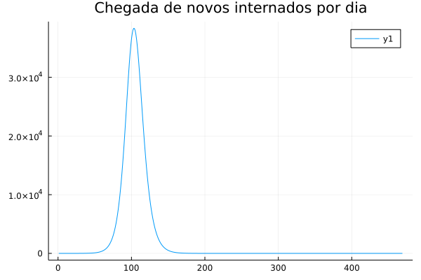
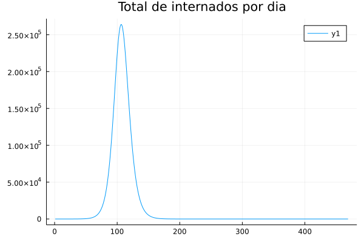
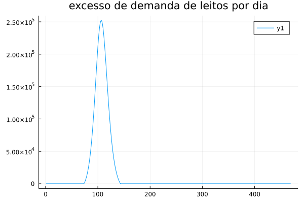
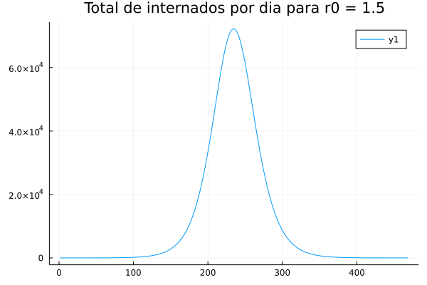

### MS211 - Turma L
# Trabalho Computacional (Lista06)

Para a simulação dos casos de covid-19 durante a pandemia, utilizaremos o modelo SEIR, que é derivado do modelo SIR, ambos serão brevemente explicados logo abaixo, mas caso não se interesse pela explicação, pule direto para a [análise](#Análise)

# Modelo utilizado

## Modelo SIR
  esse modelo base consiste em dividir a população em três estágios da doença: S, I e R, onde S - sucetíveis, I - infecciosas, e R - recuperadas consiste em descrever um comportamenteo medio de uma populacao com uma doenca infecciosa. Além disso denotamos o total da população pela letra N sendo que $ N = S + I + R $.

 ### Processo de infecção

 A cada encontro de um S com outro indivíduo este tem $\frac{I}{N}$ probabilidade de pegar a doença. Podemos modelar esta variacao de S como:

 $$ \frac{dS}{dt} = -\beta S\frac{I}{N}$$

 onde $\beta$ eh um multiplicador qualquer. Este é o modelo de decremento da população sucetível para a população infectada. Como todos que saem de S vao para I temos que:

 $$ \frac{dI}{dt} = \beta S\frac{I}{N} - \gamma I$$

onde $\gamma I$ é o total de pessoas que saem de I a vão para R por intervalo de tempo. Isso também nos da a variação de recuparados:

$$ \frac{dR}{dt} = \gamma I$$

Portanto temos que o modelo é regido pelo seguinte sistema:

$$\begin{cases} \frac{dS}{dt} = -\beta S\frac{I}{N}\\
\frac{dI}{dt} = \beta S\frac{I}{N} - \gamma I\\
\frac{dR}{dt} = \gamma I
\end{cases}$$

 ### Reescrevendo o sistema

O sistema pode ser normalizado da seguinte forma:

$$\begin{cases} \frac{dS}{dt} = -\beta \frac{S}{N}\frac{I}{N} = \beta \bold{S}\bold{I}\\
\frac{1}{N}\frac{dI}{dt} = \beta S\frac{I}{N} - \gamma I = \beta \bold{S}\bold{I} - \gamma \bold{I}\\
\frac{1}{N}\frac{dR}{dt} = \gamma \frac{I}{N}
\frac{1}{N} = \gamma \bold{I}\end{cases}$$

onde as letras em negrito indicam valores de 0 a 1.

Além disso vamos definir novas parâmetros a partir dos parâmetros β e γ originais: $ r_0 = \frac{β}{γ}$ e $T_{inf} = \frac{1}{γ}$. Esse novos parâmetros tem uma interpretação mais natural. Pois O $r_0$ é conhecido como número de reprodução basal e representa o
número de pessoas que um doente iria infectar em média durante o curso de sua
doença. O $T_{inf}$ representa o tempo médio que a pessoa fica infecciosa, ou seja a duração média que um doente fica ativamente transmitindo a
doença. Em função desses parâmetros o modelo pode ser reescrito como:

$$\begin{cases}
\frac{d\bold{S}}{dt} = \frac{r_0}{T_{inf}} \bold{S}\bold{I}\\
\frac{d\bold{I}}{dt} = \frac{r_0}{T_{inf}} \bold{S}\bold{I} - \frac{1}{T_{inf}} \bold{I}\\
\frac{d\bold{R}}{dt} = \frac{1}{T_{inf}} \bold{I}
\end{cases}$$

## Modelo SEIR
Este é o modelo que utilizaremos e sua diferença consiste na adição de uma etapa intermediária entre S e I, a etapa E - expostos, que trata-se de um estágio onde o vírus esta incubado mas não transmissível.

Com essa nova etapa podemos utilizar o mesmo procedimeto do modelo anterior para chegar ao seguinte sistema:

$$\begin{cases}
\frac{dS}{dt} = -\beta S\frac{E}{N}\\
\frac{dE}{dt} = \beta S\frac{E}{N} - \delta E\\
\frac{dI}{dt} = \delta E\frac{I}{N} - \gamma I\\
\frac{dR}{dt} = \delta I
\end{cases}$$

que pode ser reescrito como:

$$\begin{cases}
\frac{d\bold{S}}{dt} = \frac{r_0}{T_{inf}} \bold{S}\bold{I}\\
\frac{d\bold{E}}{dt} = \frac{r_0}{T_{inf}} \bold{S}\bold{I} - \frac{1}{T_{inc}} \bold{E}\\
\frac{d\bold{I}}{dt} = \frac{r_0}{T_{inc}} \bold{S}\bold{I} - \frac{1}{T_{inf}} \bold{I}\\
\frac{d\bold{R}}{dt} = \frac{1}{T_{inf}} \bold{I}
\end{cases}$$

$$r_{0} = \frac{\beta}{\gamma}$$
$$T_{inc} = \frac{1}{\delta}$$
$$T_{inf} = \frac{1}{\gamma}$$

onde $T_{inc}$ é a taxa de incubação do vírus no hospedeiro.

  
 

# Análise

## Valores iniciais
Para gerarmos o modelo vamos partir de algumas condições de contorno:

- Número de reprodução basal ($r_0$): 2.5, sendo otimista (adimensional) [2]

- Tempos médio de incubação e infecção:$T_{inc}= 5.2$ dias, $T_{inf}= 2.9$ dias [6]

- Demanda de leitos de UTI: estimava-se que 3% dos doentes precisariamde leito de UTI[3][5]

- Mediana dos tempos de UTI: 7 dias [3][5]

- Disponibilidade de leitos de UTI na região Sudeste em 2019 (antes dapandemia): 27 por 100 mil habitantes [4]

- Condição inicial:$S_0 = 0.999999$,$E_0 = 10−6$,$I_0= 0$,$R_0= 0$. Ou seja, há uma pessoa por milhão na população que está exposta e ainda não começou a transmitir a doença. Todo o restante da população é suscetível.

## Modelo

Utilizando os valores mencionados conseguimos gerar um modelo que pode ser representado pelo seguinte gráfico

Gerado pelas seguintes derivadas

## População de São Paulo

Agora, para realizarmos as análises, consideraremos a população total de 44,04 milhões de pessoas e uma disponibilidade de leitos de 27 leitos por 100 mil habitantes, ou seja, 11.891 leitos disponíveis.

## Método computacional

O método utilizado para calcular as expressões foi o Método do ponto médio[7] que consiste em ser uma versão melhorada do Método de Euler, ambos tratados em aula. Como não indeintificamos nenhum erro de cancelamento podemos assumir que a precisao de todos os resultados podem atingir precisão de $2.220446049250313 \cdot 10^ {-16}$ o epsilon da máquina em que os resultados foram calculados.

## Proporção de doentes por dia

Analisando o comportamento do modelo descrito pelo gráfico acima, podemos ver que o pico de infectados por dia acontece entre os dias 95 e 110. Utilizando uma função em Julia para encontrar o pico com uma precisão de 24 horas pudemos ver que, para o total da população mencionada (44,04 milhões) teremos um pico de 3.707.403 doentes, o que corresponde à aproximandamente 9% da população.

Pudemos ver também que este pico ocorreria no dia 103 após o início da simulação, ou seja, do primeiro contaminado.

## Leitos necessários

Para estimar o total de leitos necessários para absorver a demanda repentina causada pela pandemia devemos considerar a curva de infectados e recuperados, bem como a probabilidade de um doente precisar de um leito de UTI e seu tempo de permanência.

Para a primeira parte podemos analisar o fluxo de infectados para curados por dia, multiplicar esse valor pelo total da população e pela probabilidade de um ifectado necessitar de um leito. Com isso conseguimos o seguinte gráfico:

Agora, considerando que cada um desses novos internados precisam de 7 dias de permanencia na UTI, podemos obter o total de internados por dia somando o número de internados atual com o número de internados que estão chegando no dia e subtraindo os que chegaram a sete dias atrás:

$$ \text{internados atual }_i = \text{internados atual }_{i - 1} + \text{novos internados }_i - \text{novos internados }_{i - 7} $$
onde i é o dia atual.

Com isso conseguimos o seguinte gráfico de leitos:

Por esse gráfico podemos ter uma estimativa do total de leitos necessários no pico da pandemia. Com o auxílio de uma função de checagem de máximoem Juli conseguimos o valor exato de 263.858 leiots necessários no pico.

Agora levando em cosnideração que a disponibilidade de leitos em SP é de 27 por 100.00 habitantes, sabemos que a população em questão dispõe de 11.891 leitos, um valor muito inferior ao demandado.

Caso o cenário seja mantido, o desfalque ou execesso de demanda no pico séria de 251.967 leitos, que correspondem à 95,5% da demanda do dia.

Ao ampliarmos a análise para os dias fora do pico, fica evidente que a demanda supera a oferta em praticamente toda a curva de infectados, como mostra o gráfico abaixo:

Agora realizando uma aproximação da integral dessa curva, que equivale a soma dos valores de execesso de demanda diários, podemos ver que, ao todo, teremos 7.278.377 pacientes sem leito de UTI ao longo dos 498 dias simulados.

# Conclusão

Embora o modelo utilizado seja simples, ele consegue fornecer uma aproximação confiável do que se esperar durante a pandemia cso nenhuma ação seja tomada.

Em resumo, teremos picos de 260.000 leitos por dia e um total de 7.3 milhões de pacientes sem UTI. Este por si só já seria um desastre social e humanitário, mas além disso o colapso do sistema de saúde causaria danos colaterais enormes devido às outras doenças existentes, ao luto coletivo de milhões de paulistanos, a sobregarca dos profissionais de saúde.

Em termos financeiros, assumindo que um internado em UTI consome em média R$ 2.102,00 diários [8]. Apenas para os 11.891 leiots existentes o estado gastaria R$ 24.994.882,00. Caso assuma o compromisso de gerar a quantidad de leitos necessários o custo seria de R$ 529.634.634,00 no dia pico, desconsiderando o custo da criação desses leitos.

Outra saída para esse cenário seria a implementação de medidas restritivas e de distanciamento entre pessoas para que o número de infectados possa ser reduzido e melhor distribuído ao longo dos dias, possibilitando o tratamento e pesquisa da doença com os recursos já disponíveis. Visto que 70% do PIB do estado é composto pelo setor terciário [9], mais maleável ao regime de trabalho à distância, a implementação dessas medidas são economicamente possíveis e socialmente necessárias, devendo ser iniciadas o quanto antes pelo governador do estado em conjunto com autoridades competentes.

Caso consigamos reduzir a taxa de reprodução basal para 60% da atual, um valor possível com restrições mais rigorosas já conseguiremos reduzir o pico de leitos para 72.203, retardar o inicio do descontrole em pelo menos 2 meses e distribuir a onda de casos ao longo de 6 meses ao invés dos 2 meses previstos com as condiçõesa atuais. Melhorando drastimaente nossa capacidade de lidar com essa crise, como mostra o gráfico abaixo:

  
 

# Referências
[1] Julie C. Blackwood and Lauren M. Childs. An introduction to compart-mental modeling for the budding infectious disease modeler.Letters in Bi-omathematics, 5(1):195–221, December 2018.

[2] Ying Liu, Albert A Gayle, Annelies Wilder-Smith, and Joacim Rocklöv. Thereproductive number of COVID-19 is higher compared to SARS coronavirus.Journal of Travel Medicine, 27(2), March 2020.

[3] Seyed M. Moghadas, Affan Shoukat, Meagan C. Fitzpatrick, Chad R. Wells,Pratha Sah, Abhishek Pandey, Jeffrey D. Sachs, Zheng Wang, Lauren A.Meyers, Burton H. Singer, and Alison P. Galvani. Projecting hospital utili-zation during the COVID-19 outbreaks in the United States.Proceedings ofthe National Academy of Sciences, 117(16):9122–9126, April 2020.

[4] Úrsula Neves. Covid-19: IBGE divulga distribuição de UTIs, respiradorese profissionais de saúde no Brasil.  https://pebmed.com.br/covid-19-ibge-divulga-distribuicao-de-utis-respiradores-e-profissionais-de-saude-no-brasil/,May 2020.

[5] Rachel Lane Socolovithc, Renata Rego Lins Fumis, Bruno Martins Tomazini,Laerte Pastore, Filomena Regina Barbosa Gomes Galas, Luciano Cesar Pon-tes de Azevedo, and Eduardo Leite Vieira Costa. Epidemiology, outcomes,and the use of intensive care unit resources of critically ill patients diag-nosed with COVID-19 in Sao Paulo, Brazil: A cohort study.PLOS ONE,15(12):e0243269, December 2020.

[6] Joseph T Wu, Kathy Leung, and Gabriel M Leung. Nowcasting and fore-casting the potential domestic and international spread of the 2019-nCoVoutbreak originating in Wuhan, China: A modelling study.The Lancet,395(10225):689–697, February 2020.8

[7] Vários Autores. Midpoint method, WikiPédia,  https://en.wikipedia.org/wiki/Midpoint_method 2021. (considerar principalmente as referências da página)

[8] Vários Autores. Covid-19: custo médio de diária em UTI é de R$ 2.102, Medicina SA,  https://medicinasa.com.br/covid-custo-uti/ 2020. (considerar principalmente as referências da página)

[9] Renato Candido da Silva. Economia de São Paulo, Infoescola,  https://www.infoescola.com/economia/economia-de-sao-paulo/ 2020.

